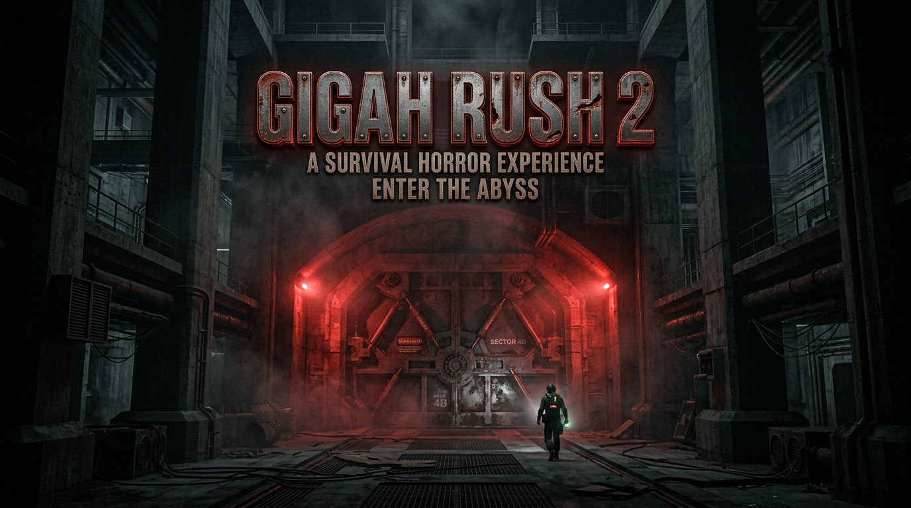

<div align="center">



# GIGAH|RUSH 2 — Architectural Manifesto & Next-Gen Voxel Engine

[]()
[-red?style=for-the-badge)]()
[](https://github.com/Jirnyak/gigahrush2/actions/workflows/source-rules.yml)
[]()
[]()

> **Universal 3D Voxel Core Engine & Emerging Society Simulation Engine**
> Authored by **Graf Irnyak (Klaus Schwab)** & **Adolf Petushkov** (2026).

[🌐 Live Showcase](https://Jirnyak.github.io/gigahrush2/) &nbsp;·&nbsp; [📖 Architecture Document](ARCHITECTURE.md) &nbsp;·&nbsp; [📜 Agent Mandates](AGENTS.md)

</div>

---

## 🏛️ Architectural Manifesto (Klaus Schwab / Graf Irnyak Directives)

### Core Operational Principles
1. **Feature without live gameplay proof = DECLINED.** Padic preferred proof floor when geometry stress matters. Regular pull-push-commit on `main`. Never stage `shaders/**` without explicit reason.
2. **Feature not based on any fundamental core system = DECLINED.** Every mechanic must be an emergent layer over core engines (voxel, physics, ECS, macropopulation, attributes).
3. **All Content is Data-Driven.** Attributes, item drops, loot tables, mob traits, floor modules are loaded from CSV/tables (`data/items.csv`, `data/mobs.csv`), never hardcoded `if`-chains in C++.
4. **Ruthless Purge Policy ("Нещадная чистка"):** Cut and delete legacy meshing hacks, multi-colored striping, hardcoded keybindings, and random isolated mechanics. Core simplicity outranks secondary fluff.
5. **Retro-Pixel / VHS / CRT UI Mandate ("Интерфейс це важно"):** All HUD and canvas overlays must follow the Soviet-punk service-equipment ("служебная аппаратура") CRT aesthetic from GigaHrush 1 (`taste.md`). No sterile modern flat chrome, zero rounding (0.0f), phosphor green on near-black CRT alpha background.

---

## 🌐 Fundamental Engine Invariants

```
+-------------------------------------------------------------------------+
|                         GIGAHRUSH 2 WORLD STACK                        |
+-------------------------------------------------------------------------+
|  MACROPOPULATION (Source of Truth)                                      |
|  - Up to 1,000,000 cold NPCs across the Gigahrush tower                |
|  - Society sim: migration, economy, relationships, persistent stats     |
+-------------------------------------------------------------------------+
                                    | Embodiment / Sync (up to 16k NPCs)
                                    v
+-------------------------------------------------------------------------+
|  ACTIVE FLOOR (128x128x128 Cells / 1024x1024x1024 Sub-Voxel Atoms)     |
|  - Toroidal 3D wrapping on X/Y/Z axes                                   |
|  - Destructible materials via probabilistic damage penetration          |
|  - Samosbor waves & real-time floor geometry baking                     |
|  - 16 elevator shafts (4x4 lattice), each serving fast-travel AND rides |
|  - Hermetic rooms: Living, Toilets, Kitchens, Workshops, Smoking, Lairs |
+-------------------------------------------------------------------------+
                                    | EnTT ECS Views / Zero-Alloc Ticks
                                    v
+-------------------------------------------------------------------------+
|  SYMMETRICAL ENTITY & PLAYER PARADIGM                                   |
|  - Player = NPC model with a CameraTag + Controller attached to head     |
|  - 100% Symmetrical combat, ballistics, damage, armor, and inventory    |
|  - Possess / Psi-Control allows switching control across any NPC/mob    |
+-------------------------------------------------------------------------+
```

### 1. Active Floor Topology & Torus
- **128³ Cell Grid:** Active floor is a $128 \times 128 \times 128$ toroidal world. `kMacroDim = 128` cells at `kCellSize = 2.0` m, so **`kWorldExtent = 256` m** — the wrap period is the METRE extent, never the cell count. (Writing 128 here is the half-period mistake `problems.md` §7 cost a month to find.)
- **1024³ Sub-Voxel Atoms:** Each cell contains $8 \times 8 \times 8$ sub-voxel material atoms ($1024^3$ total sub-voxels per floor).
- **Toroidal Wrapping:** X, Y, and Z axes wrap seamlessly (`wrap_macro` / `wrap_delta`). Falling off any face re-enters from the opposite side. Level stack (W axis) does not wrap.

### 2. Macropopulation — Cold Society Simulation (Single Source of Truth)
- **1,000,000 Cold Society NPCs:** Tracks the entire population of the Gigahrush tower (names, level, 8 attributes, inventory, relationships, perks, home floor).
- **Embodiment Sync:** When a floor loads, up to 16,000 NPCs are contextually embodied into active floor ECS entities. Upon floor transition/save, embodied state syncs back to the cold macropopulation.

### 3. Samosbor Dynamics & Real-Time Reconfiguration
- **Alarm & Purple Fog:** Samosbor triggers warning sirens, purple fog, and voxel transformation waves that erode geometry at sub-voxel level.
- **Hermetic Rooms:** NPCs flee to nearest sealed living quarters.
- **Post-Samosbor Re-Bake:** Floor geometry & $O(1)/O(N)$ navmaps are dynamically re-baked post-wave seamlessly.

### 4. Symmetrical Entity & Player Paradigm
- **Player is an NPC:** The player is simply an NPC model with a `CameraTag` and `Controller` attached to its head.
- **Possess Ability:** Psi-control (`possess`) allows switching control to any NPC or mob.

### 5. RPG & 8-Attribute System ($2^3$ Power-of-Two Storage)
- **Baseline (Level 0):** 8 attribute points, 1 perk point. Base HP = 100, Base Psi = 100 (`kBaseHp`/`kBasePsi`, [src/game/rpg.h](src/game/rpg.h) — the pool is symmetric with HP).
- **Leveling:** Each level grants +1 Attribute Point. Every 2nd level grants +1 Perk Point.
- **8 Attributes** — *TARGET, not yet built.* Today `enum class Attr { Str, Agi, Int }` and `RpgStats.attr[3]` ([src/game/rpg.h](src/game/rpg.h)); the pool's generic block already reserves 8 slots, so slots 3..7 are free. See the conflict table at the end of [ARCHITECTURE.md](ARCHITECTURE.md).
  1. **Strength (Сила):** Melee damage multiplier (+1%).
  2. **Agility (Ловкость):** Weapon reload / attack speed (+1%).
  3. **Intelligence (Интеллект):** Psi damage (+1%).
  4. **Charisma (Харизма):** Trading discount & relationship bonus (+1).
  5. **Willpower (Сила воли):** Psi capacity (+1 flat).
  6. **Endurance (Выносливость):** Carry weight (+1 kg). *Today carry weight is on **Strength** instead (+4 kg/point) — there is no Endurance attribute to read, and wiring the budget to one that exists beat leaving it unbuilt. One line moves when slot 5 lands.*
  7. **Vitality (Живучесть):** Max HP (+1%).
  8. **Speed (Скорость):** Movement speed (+1%).
- **Needs & Survival:** HP, Psi (mana), Food, Water, Toilet, Sleep. High food passively restores HP.

### 6. Ballistics, Voxel Destruction & Armor
- **Honest 3D Ballistics:** Projectiles/bullets move along real 3D trajectories with universal friendly fire. Grenades bounce off voxels with explosive shrapnel radius.
- **Damage Types:** Piercing, Bludgeoning, Psi, Fire, Energy.
- **Probabilistic Voxel Erosion:** Material table maps damage types to destruction probability (zero-alloc, no per-voxel HP). Auto bursts on walls chip sub-voxel paint.

### 7. Inventory Grid & Equipment
- **Grid Layout:** Fixed $8 \times 8$ inventory grid + carry weight — **64 kg + 4 kg per point of Strength** ([rpg.h](src/game/rpg.h) `carry_capacity_g`; both constants are powers of two in kg, so a capacity is always even). Every item carries `mass_g` in whole grams, the same unit and column name props and mobs use. Overload costs pace, sleep and stealth — and, because the load joins the body's `Mass`, it also makes falls hurt and knockback shift you less, through laws that did not change ([items.md](items.md), [encumbrance.h](src/game/encumbrance.h)).
- **Slots:** Weapon, Armor, Psi, Tools (Flashlight with durability/battery).
- **Death Drops:** Dead NPCs drop inventory into floor cell containers ($128^3$).

---

## 📚 Documentation Map

`AGENTS.md` and `ARCHITECTURE.md` both state that this README orchestrates the
per-system docs; until 2026-08-09 no such index existed here. This is it.

**Authority, in order.** [AGENTS.md](AGENTS.md) (hard rules, working method) →
[ARCHITECTURE.md](ARCHITECTURE.md) (layers + the owner's game manifesto) → the
per-system files below. [master_prompt.md](master_prompt.md) wins on "what state
is the game layer in and what's next"; [problems.md](problems.md) is the defect
registry (§1–§45) and outranks any doc that disagrees with a measured finding.

**Design specs & roadmap** — the forward-looking layer, added 2026-08-09:

| Document | Scope |
|---|---|
| [Docs/MASTER_ROADMAP.md](Docs/MASTER_ROADMAP.md) | Phased plan 0→6, dependency graph, per-phase acceptance number |
| [Docs/specs/01_ALIFE_AND_UTILITY_AI.md](Docs/specs/01_ALIFE_AND_UTILITY_AI.md) | Social roles, affordance rows, panic, section hierarchy |
| [Docs/specs/02_VOXEL_PHYSICS_AND_FLUIDS.md](Docs/specs/02_VOXEL_PHYSICS_AND_FLUIDS.md) | Carving gates, GPU fields, structural stress, gas/fire/smoke |
| [Docs/specs/03_ECONOMY_MASS_AND_CRAFTING.md](Docs/specs/03_ECONOMY_MASS_AND_CRAFTING.md) | Wear/jamming/fouling, equip slots, junk crafting |
| [Docs/specs/04_RENDER_AND_ACOUSTICS.md](Docs/specs/04_RENDER_AND_ACOUSTICS.md) | Post-process target, CRT toggle, acoustics from zero |
| [Docs/specs/05_TESTING_AND_PERF_BUDGETS.md](Docs/specs/05_TESTING_AND_PERF_BUDGETS.md) | Isotropy gate, budget assertions, class-closing gates |
| [Docs/specs/06_SAMOSBOR_AND_CRISIS.md](Docs/specs/06_SAMOSBOR_AND_CRISIS.md) | Fog field, hermetic zones, geometry-rewriting wave, PSI pool |
| [Docs/specs/07_MAINCPP_DECOMPOSITION.md](Docs/specs/07_MAINCPP_DECOMPOSITION.md) | 5927-line main.cpp split: 8 extractable regions, AppState |
| [Docs/specs/08_WORLD_FLOORS_AND_ROOMS.md](Docs/specs/08_WORLD_FLOORS_AND_ROOMS.md) | Single floor predicate chain, 11 room fields, anomalies |
| [Docs/specs/09_COMBAT_BALLISTICS_AND_RPG.md](Docs/specs/09_COMBAT_BALLISTICS_AND_RPG.md) | Honest friendly fire, psi pool, INT attribute, status producers |
| [Docs/specs/10_SAVE_AND_PERSISTENCE.md](Docs/specs/10_SAVE_AND_PERSISTENCE.md) | Save v10: samosbor clock, NPC memory, no-migration contract |
| [Docs/specs/11_SOCIAL_SYSTEMS.md](Docs/specs/11_SOCIAL_SYSTEMS.md) | Speech, rumour, vendor, quests; the severed faction→price link |
| [Docs/specs/12_MACRO_SIM_AND_NPC_POOL.md](Docs/specs/12_MACRO_SIM_AND_NPC_POOL.md) | 2^20 pool, embodiment round trip, the unbudgeted demography sweep |
| [Docs/specs/13_BESTIARY_TRAITS_AND_SPAWN.md](Docs/specs/13_BESTIARY_TRAITS_AND_SPAWN.md) | 68 kinds, trait dispatch, spawn weighting, hunt throttle |
| [Docs/specs/14_NEEDS_AND_SURVIVAL.md](Docs/specs/14_NEEDS_AND_SURVIVAL.md) | Five needs, digestion loop, encumbrance, cold-NPC gap |
| [Docs/specs/15_BAKED_NAVIGATION.md](Docs/specs/15_BAKED_NAVIGATION.md) | 130 MiB/floor (peak 260), flight-field vs walk-field, 9 nav.md divergences |
| [Docs/specs/16_ELEVATORS_AND_FLOOR_STREAMING.md](Docs/specs/16_ELEVATORS_AND_FLOOR_STREAMING.md) | 16 shafts not 32, 6.4s revisit vs 130ms first visit, no floor stash |
| [Docs/specs/17_ITEM_DATA_AND_CONTAINERS.md](Docs/specs/17_ITEM_DATA_AND_CONTAINERS.md) | 442 items (not 446), 14 dead CSV columns, nowhere to store anything |
| [Docs/specs/18_BUILD_GATES_AND_CI.md](Docs/specs/18_BUILD_GATES_AND_CI.md) | CI cannot configure (no Vulkan SDK step), 5 platform asymmetries, no -Werror |
| [Docs/specs/19_ECS_COMPONENTS_AND_ORDER.md](Docs/specs/19_ECS_COMPONENTS_AND_ORDER.md) | 39 components, 6 Velocity writers, Corpse loot lost on save |
| [Docs/specs/21_RUMOURS_AND_INFORMATION.md](Docs/specs/21_RUMOURS_AND_INFORMATION.md) | A truth generator with no NPC listener; 4 of 9 kinds unreachable behind a one-line shim |

Each spec opens with **what is already built** so no session re-specifies working
code, and every claim carries a `file:line`.

Specs 20 and 21 additionally carry a dated **what changed while this was being
written** section: both subsystems were wired by a parallel session within the
hour, so the "current state" half of a spec is perishable and is kept separable
from the reasoning half on purpose.

**Per-system contracts** — what the engine does today:

| Layer | Documents |
|---|---|
| World / voxels | [world.md](world.md) · [voxels.md](voxels.md) · [fields.md](fields.md) · [gravity.md](gravity.md) · [destruct.md](destruct.md) |
| Simulation | [physics.md](physics.md) · [controller.md](controller.md) · [camera.md](camera.md) · [fluid.md](fluid.md) · [diffusion.md](diffusion.md) · [nav.md](nav.md) |
| Game layer | [floors.md](floors.md) · [elevators.md](elevators.md) · [npcs.md](npcs.md) · [ai.md](ai.md) · [macrosim.md](macrosim.md) · [monsters.md](monsters.md) · [items.md](items.md) · [props.md](props.md) · [antourage.md](antourage.md) |
| Platform | [render.md](render.md) · [ecs.md](ecs.md) · [events.md](events.md) · [netcode.md](netcode.md) |
| Cross-cutting | [performance.md](performance.md) · [jirnyak.md](jirnyak.md) · [worldgen.md](worldgen.md) (tombstone) |

---

## 🔧 Build & Execution

### Prerequisites
- C++23 compliant compiler (Clang 16+, GCC 13+, MSVC 2022+)
- CMake 3.25+
- Vulkan drivers (MoltenVK on macOS); `glslc` from shaderc
- SDL3, EnTT

### Building Locally
```bash
# Configure & build headless tests + main binary.
# RELEASE, always. A Debug tree is ~10x slower on the sim (measured: 62.2 ms/frame
# at -O0 against 5.9 ms at -O3, identical code) and reads exactly like a regression
# in whatever landed last — see AGENTS.md §Build.
cmake -S . -B build -DCMAKE_BUILD_TYPE=Release
cmake --build build -j

# Run headless verification suite
ctest --test-dir build --output-on-failure
```

> Run the game **from the repo root**: `data/textures` is resolved relative to the
> working directory, and from anywhere else all six texture sets silently fail to
> load and the world renders procedural-only ([problems.md](problems.md) §31).

---

## 📜 License

Distributed under the **True People's License v2.0** — Authors: **Jirnyak (Klaus Schwab)** & **Adolf Petushkov** (2026). Free for all maintainers, developers, and AI research. Zero paywalls.
