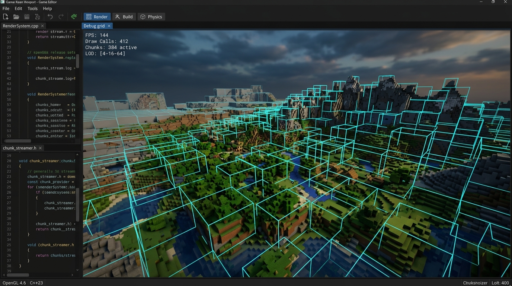
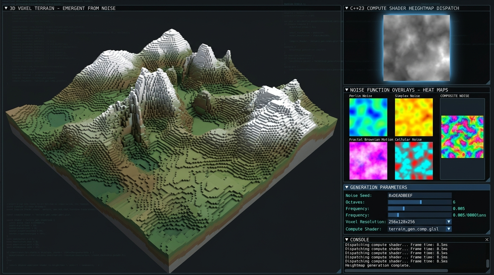
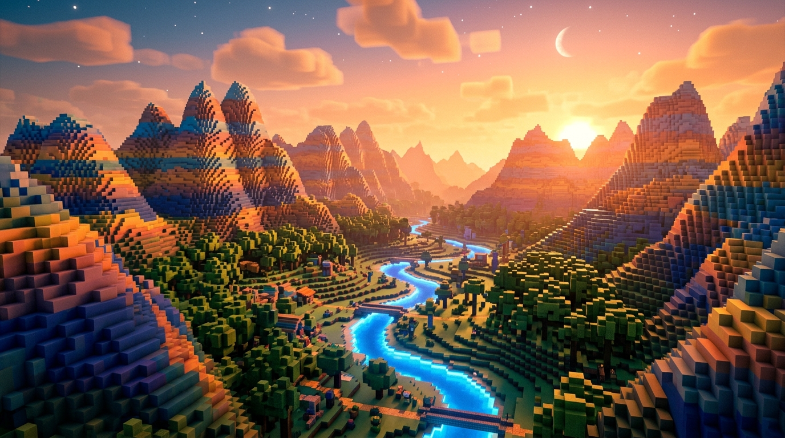
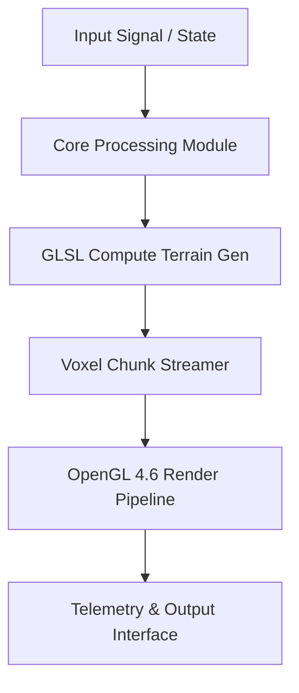

# GIGAH|RUSH 2 — Next-Gen C++23 OpenGL Voxel Pipeline

> **Production-grade next-gen voxel rendering engine — C++23, OpenGL 4.6, zero-allocation runtime.**

[🌐 Live Showcase](https://Jirnyak.github.io/gigahrush2/) &nbsp;·&nbsp; [📊 Architecture](#-system-architecture--pipeline)

---

   &nbsp;
   &nbsp;
  

---

## 🎨 Engine Gallery

*OpenGL 4.6 voxel chunk streaming — LOD system, GPU instancing, real-time chunk generation*

---

<table>
<tr>
<td width="50%"></td>
<td width="50%"></td>
</tr>
<tr>
<td align="center"><i>Procedural generation — GLSL compute shader, multi-octave noise</i></td>
<td align="center"><i>Final render — ambient occlusion, dynamic lighting, cinematic view</i></td>
</tr>
</table>

---

## 📖 Architecture Overview

GigaHRush 2 is the next evolution of the Samosbor voxel engine — rebuilt with **C++23** and **OpenGL 4.6**, featuring:

- **Zero-allocation runtime** — buffer pools, no heap churn during simulation
- **Modular chunk system** — streaming, LOD, async generation
- **GLSL compute shaders** — terrain generation entirely on GPU
- **Lock-free job queue** — parallel chunk meshing, no mutex contention

---

## 📊 System Architecture & Pipeline

---

## 🔧 Technical Configuration

| Parameter Key | Type | Default | Description |
|---|---|---|---|
| `MAX_BUFFER_SIZE` | SizeT | `65536` | Maximum pre-allocated memory buffer in bytes |
| `FRAME_RATE_TARGET` | Int | `60` | Target loop frequency in Hz |
| `CHUNK_SIZE` | Int | `32` | Voxel chunk dimensions (32³) |
| `LOD_LEVELS` | Int | `4` | Level of detail cascade count |
| `THREAD_POOL_COUNT` | Int | `8` | Worker threads for chunk meshing |

---

## 📜 License

Distributed under the **True People's License v2.0** — Authors: **Jirnyak** & **Adolf Petushkov** (2026). Free for all maintainers, developers, and AI research. Zero paywalls.
