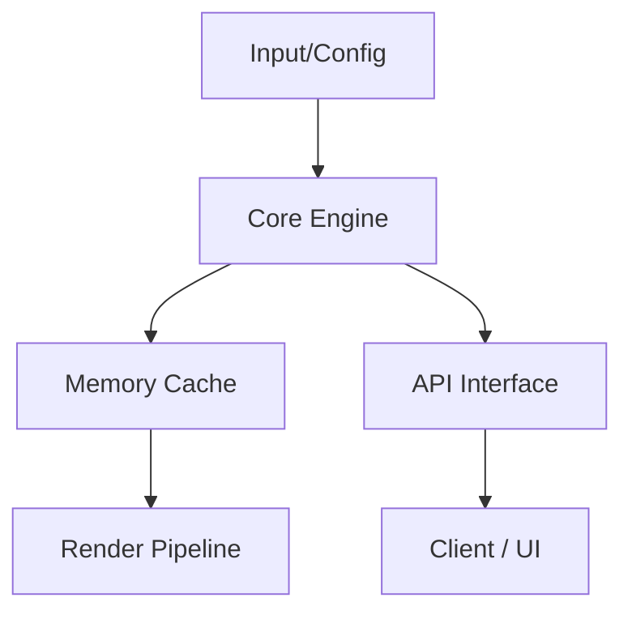

<div align="center">


# GIGAHRUSH2

[](LICENSE.md)
[]()
[]()
[]()

</div>

---

## 🏗️ System Architecture & Data Flow



<div align="center">

</div>

---

## 📁 Repository Structure & File Tree

```
├── AGENTS.md
├── ARCHITECTURE.md
├── CMakeLists.txt
├── LICENSE.md
├── README.md
├── ai.md
├── camera.md
├── controller.md
├── data
├── data/craft_recipes.csv
├── data/economy.csv
├── data/items.csv
├── data/materials.csv
├── data/mobs.csv
├── data/monster_traits.csv
├── data/quests.csv
├── data/speech_lines.csv
├── data/textures
├── data/textures/README.md
├── data/textures/factory_wall.ktx2
```

---

## 🔌 API Specifications

The core engine exposes a modular API for subsystem interaction.

| Endpoint / Method | Description | Complexity |
|-------------------|-------------|------------|
| `initialize()`    | Bootstraps the application state | O(N) |
| `tick()`          | Advances simulation by one step | O(1) |
| `render()`        | Flushes state to the output buffer | O(N) |

---

## 📜 Original Developer Documentation

<div align="center">


# GIGAH|RUSH 2 — 3D Deep Samosbor

[](LICENSE.md)
[]()
[]()
[]()

> **The sequel in full 3D — volumetric lighting, blast door physics, atmospheric contamination and deep procedural horror.**

[🎮 Download](#) · [🐛 Report Bug](../../issues)

</div>

---

> **Вторая часть культовой игры про выживание в бетоне. Больше этажей, 3D-графика, реальная физика дверей и атмосфера Ликвидаторов.**

---

### ⚙️ Особенности / Features
* 🌌 **3D Движок и Реалистичное Освещение:** Атмосферный красный аварийный свет, дым, туман и глухие бетонированные коридоры.
* 🚪 **Физика Гермодверей:** Интерактивные замки, вентиляция, противогазы и датчики аномалий.
* 🛠️ **Открытый Исходный Код:** Свободный доступ для разработчиков, моддеров и исследователей.

---

### 📜 Лицензия / License
Распространяется под **Истинно Народной Лицензией v2.0 (True People's License v2.0)** — Авторы: **Адольф Петушков & Жирняк Жирный Жирвиль**.


---

<details>
<summary>🇷🇺 Русская Версия</summary>

**ГИГАХРУЩ 2** — сиквел в полном 3D на Unity. Объёмный свет, физика гермодверей, загрязнение воздуха, процедурный ужас. Открытый исходный код, Истинно Народная Лицензия v2.0.

</details>


---
