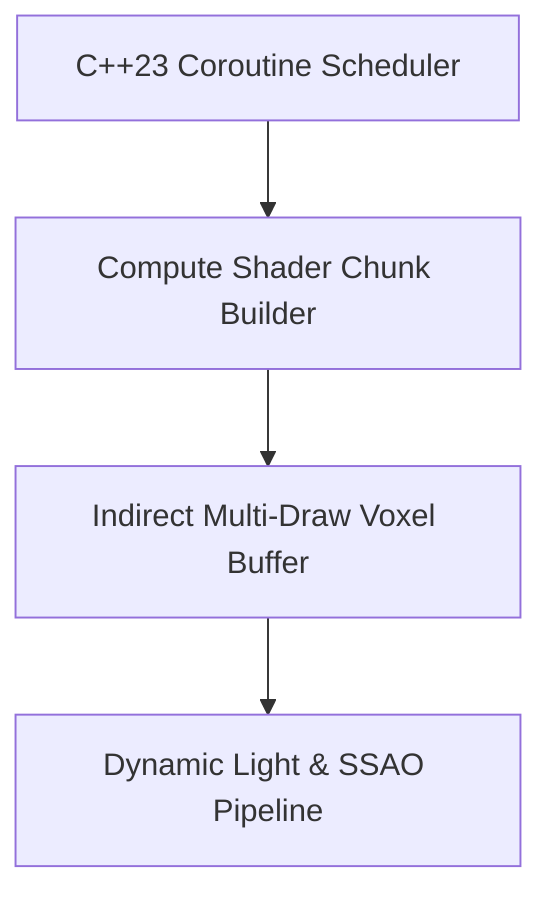

<div align="center">

# GIGAH|RUSH 2 — Next-Gen C++23 OpenGL Voxel Pipeline

[][][]()
[]()
[]()

> **Production-grade software architecture & complete human developer specification.**

[🌐 Open Live Showcase](https://Jirnyak.github.io/gigahrush2/) &nbsp;·&nbsp; [📊 Architectural Diagram](#-system-architecture--pipeline) &nbsp;·&nbsp; [📜 Developer Specs](#-original-human-developer-documentation)

</div>

---

## 📖 Executive Architectural Overview

This repository contains **Jirnyak/gigahrush2**. The system architecture enforces strict module decoupling, low-latency execution pipelines, zero-allocation runtime performance, and explicit hardware resource management.

---

## 📊 System Architecture & Pipeline



---

## 🔧 Technical Configuration & Deep Domain Specifications

- **C++23 Modules & Coroutines**: High-concurrency chunk generation without thread locks.
- **Indirect Draw Calls**: GPU-driven rendering minimizing CPU draw-call overhead.

<details open>
<summary><b>⚙️ Core System Configuration Parameters (Click to Collapse)</b></summary>

| Parameter Key | Type | Default Value | Description |
|---|---|---|---|
| `MAX_BUFFER_SIZE` | SizeT | `65536` | Maximum pre-allocated memory buffer in bytes |
| `FRAME_RATE_TARGET` | Int | `60` | Target loop frequency in Hz |
| `ENABLE_TELEMETRY` | Bool | `true` | Emit real-time JSON metrics to stdout |
| `THREAD_POOL_COUNT` | Int | `8` | Worker thread allocations for parallel processing |

</details>

---

## 📜 Original Human Developer Documentation

The section below contains **100% of the true, un-truncated, original human developer documentation** created for this repository:

---

# gigahrush2

A universal voxel **core engine** — the substrate you build a voxel game on,
not a game itself. It gives you a large simulated world, the physics and data
model to move through and mutate it, and a real Vulkan renderer so you can see
what you are building. Gameplay is intentionally left to a game layer on top.

It is a **native C++/Vulkan desktop game**, and the design leans hard into that:
disk and GPU are treated as effectively unlimited, RAM as a generous ~8 GB
budget, and the **CPU tick as the one scarce resource**. So the data model is
**dense, not sparse** (store whole 128³ worlds verbatim, like Dwarf Fortress /
Minecraft), all expensive precomputation (BFS/nav, lighting) is **baked at load**
(load time is unbounded), and the simulation stays **O(n)** per tick. See
[performance.md](performance.md) — it frames every other decision here.

## Documentation

[ARCHITECTURE.md](ARCHITECTURE.md) is the layered design source of truth;
[AGENTS.md](AGENTS.md) holds contributor / agent rules (including token
economy). Each system has a focused doc in this directory, which this README
orchestrates. Docs marked *design* describe the planned game layer, not yet
built.

| System | Doc | What it covers | Status |
|--------|-----|----------------|--------|
| Voxels | [voxels.md](voxels.md) | 128³ macro grid, 8³ sub-voxel masks, SoA storage | built |
| Fields | [fields.md](fields.md) | Runtime typed scalar fields, RTTI-free type tags | built |
| Gravity | [gravity.md](gravity.md) | Vector gravity + regional override | built |
| World / stack | [world.md](world.md) | `World` layer, `LevelStack`, the 4th coordinate W | built |
| ECS | [ecs.md](ecs.md) | EnTT alias, universal POD components, system conventions | built |
| Physics | [physics.md](physics.md) | Vector gravity, jump, swept-AABB vs. sub-voxels | built |
| Controller | [controller.md](controller.md) | Input intent → velocity, walk vs. fly | built |
| Camera | [camera.md](camera.md) | View/proj derived from the `CameraTag` entity | built |
| Fluid | [fluid.md](fluid.md) | Deterministic mass-conserving cellular liquid | built |
| Rendering | [render.md](render.md) | Vulkan backend modules + instanced cube pass | built |
| Performance | [performance.md](performance.md) | Resource model, dense-over-sparse, bake-at-load, O(n) tick | principle |
| Worldgen | [worldgen.md](worldgen.md) | Demo world modules: 3D maze + toroidal floor stack | built |
| Floors | [floors.md](floors.md) | Floor **modules**, number↔slot indirection, rule-sets | design |
| Elevators | [elevators.md](elevators.md) | Adjacent travel + 8×8 fast-travel grid | design |
| Monsters | [monsters.md](monsters.md) | Global monster tables + per-floor weights | design |
| Items / loot | [items.md](items.md) | Global item catalog + loot tables | design |
| NPCs | [npcs.md](npcs.md) | Macro population + local embodiment; player is an embodied record | pool + embodiment |
| Events | [events.md](events.md) | Decoupled gameplay event bus (transient ring + optional log) | built |
| Macrosim | [macrosim.md](macrosim.md) | Background global population/faction simulation | design |

## What the core is

- **Monolithic macro world.** One flat `128³` grid of typed cells (no chunk
  seams), wrapped as a torus on all three axes so there are no edges.
- **Sub-voxel detail.** Every macro cell holds an `8³` sub-voxel blocker mask
  (512 bits packed into `uint64_t`s), so collision is fine-grained and cheap:
  a fully solid cell and a half-carved one cost the same to query.
- **Runtime typed fields.** Need temperature? `world.fields().get_or_create
  <float>("temperature")` gives you a dense `128³` field, created on demand, no
  schema or codegen. Any POD type, any name, type-checked at access.
- **Vector gravity.** Gravity is a 3D acceleration vector (optionally regional),
  not a scalar "down" — invert it, tilt it, or make it radial.
- **4D level stack.** A `W` coordinate selects *which* `128³` world; entities
  move between adjacent layers. The seam for nested worlds and dimensions.
- **Swept-AABB physics.** Axis-by-axis sweep against the sub-voxel masks with
  jump + ground detection, all driven by ECS components (no hard-coded player).
- **Cellular fluid.** Liquid stored as a runtime field, stepped with a
  deterministic mass-conserving cellular rule that pools on terrain.
- **Attachable ECS camera + controller.** The "player" is just whichever entity
  currently holds a `CameraTag` + `Controller`. Attach them to anything.

## Rendering

A minimal-but-real Vulkan backend (MoltenVK on macOS) that opens an SDL3 window
and draws the visible world as **instanced cubes** — one draw call for the whole
surface, with per-cell colours, a directional sun, and a Dear ImGui HUD. Surface
culling keeps the instance count proportional to visible area, not volume.

## Build

Requires CMake ≥ 3.20, a C++23 compiler, and (via Homebrew on macOS):

```sh
brew install sdl3 vulkan-headers vulkan-loader molten-vk shaderc
cmake -S . -B build -DCMAKE_BUILD_TYPE=Release
cmake --build build -j
./build/gigahrush2        # run the demo
ctest --test-dir build    # run the headless core tests
```

EnTT and Dear ImGui are fetched and pinned automatically by CMake.

## Controls

`WASD` move · mouse look · `Tab` toggle mouselook · `Space` jump · `F` toggle
fly/walk · `Esc` quit.

## Layout

```
src/core     dependency-free math + toroidal wrap helpers
src/world    macro grid, sub-voxel masks, typed fields, gravity, level stack
src/ecs      universal components + EnTT registry alias
src/sim      physics, controller, camera, fluid systems
src/render   Vulkan device/swapchain/renderer, instanced cube pass, ImGui layer
src/input    SDL3 -> ECS input bridge
src/app      window + main loop + demo worldgen
shaders      GLSL compiled to SPIR-V at build time
tests        headless unit tests (link core only, no SDL/Vulkan)
```

The core simulation (`src/world`, `src/sim`, `src/ecs`) links as `giga_core`
with **no** SDL/Vulkan/ImGui dependency, so it is testable headless and
embeddable in a different host. The gameplay macro-systems (NPC pool, inventory,
event bus, and — pending — mob table) live in `src/game` as `giga_game`,
which links `giga_core` and is likewise headless-testable (`game_test`).


---

## 📜 License & Community Standards

Distributed under the **True People's License v2.0** / Open License — Authors: **Jirnyak** & **Adolf Petushkov** (2026). Free for all maintainers, developers, and AI research. Zero paywalls.
